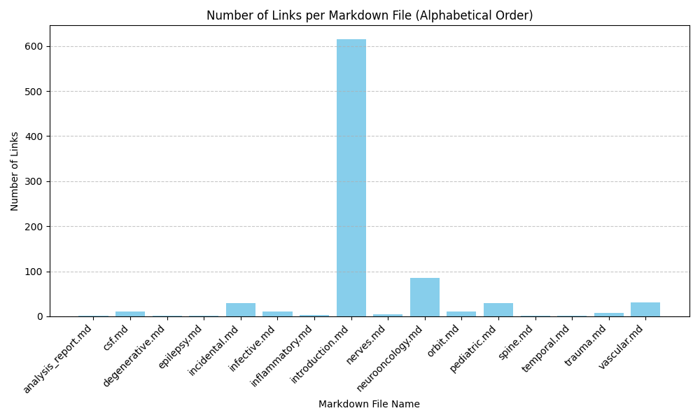

# Markdown Files Analysis Report

Report generated on 2025-06-26 17:10:29.

---
## Summary of Links per File

Below is a bar plot visualizing the number of links found in each Markdown file, sorted alphabetically. You can find the image saved as `links_barplot.png`.

---
## Detailed File Analysis

### File: `csf.md`

- **Number of Links**: 9

- **Headings (Chapters) by Level**:

  - `#` (Level 1): 1 chapters

  - `##` (Level 2): 2 chapters

### File: `degenerative.md`

- **Number of Links**: 0

- **Headings (Chapters) by Level**:

  - `#` (Level 1): 1 chapters

### File: `epilepsy.md`

- **Number of Links**: 2

- **Headings (Chapters) by Level**:

  - `#` (Level 1): 1 chapters

  - `##` (Level 2): 1 chapters

### File: `incidental.md`

- **Number of Links**: 24

- **Headings (Chapters) by Level**:

  - `#` (Level 1): 1 chapters

  - `##` (Level 2): 3 chapters

  - `###` (Level 3): 4 chapters

### File: `infective.md`

- **Number of Links**: 9

- **Headings (Chapters) by Level**:

  - `#` (Level 1): 1 chapters

  - `##` (Level 2): 3 chapters

### File: `inflammatory.md`

- **Number of Links**: 3

- **Headings (Chapters) by Level**:

  - `#` (Level 1): 1 chapters

  - `##` (Level 2): 2 chapters

### File: `introduction.md`

- **Number of Links**: 554

- **Headings (Chapters) by Level**:

  - `#` (Level 1): 1 chapters

  - `##` (Level 2): 10 chapters

  - `###` (Level 3): 21 chapters

  - `####` (Level 4): 13 chapters

  - `#####` (Level 5): 6 chapters

### File: `nerves.md`

- **Number of Links**: 4

- **Headings (Chapters) by Level**:

  - `#` (Level 1): 1 chapters

  - `##` (Level 2): 1 chapters

### File: `neurooncology.md`

- **Number of Links**: 18

- **Headings (Chapters) by Level**:

  - `#` (Level 1): 1 chapters

  - `##` (Level 2): 9 chapters

  - `###` (Level 3): 1 chapters

### File: `orbit.md`

- **Number of Links**: 5

- **Headings (Chapters) by Level**:

  - `#` (Level 1): 1 chapters

  - `##` (Level 2): 2 chapters

### File: `pediatric.md`

- **Number of Links**: 28

- **Headings (Chapters) by Level**:

  - `#` (Level 1): 1 chapters

  - `##` (Level 2): 7 chapters

  - `###` (Level 3): 4 chapters

### File: `spine.md`

- **Number of Links**: 2

- **Headings (Chapters) by Level**:

  - `#` (Level 1): 1 chapters

  - `##` (Level 2): 1 chapters

### File: `temporal.md`

- **Number of Links**: 1

- **Headings (Chapters) by Level**:

  - `#` (Level 1): 1 chapters

### File: `trauma.md`

- **Number of Links**: 7

- **Headings (Chapters) by Level**:

  - `#` (Level 1): 1 chapters

  - `##` (Level 2): 4 chapters

### File: `vascular.md`

- **Number of Links**: 27

- **Headings (Chapters) by Level**:

  - `#` (Level 1): 1 chapters

  - `##` (Level 2): 2 chapters

